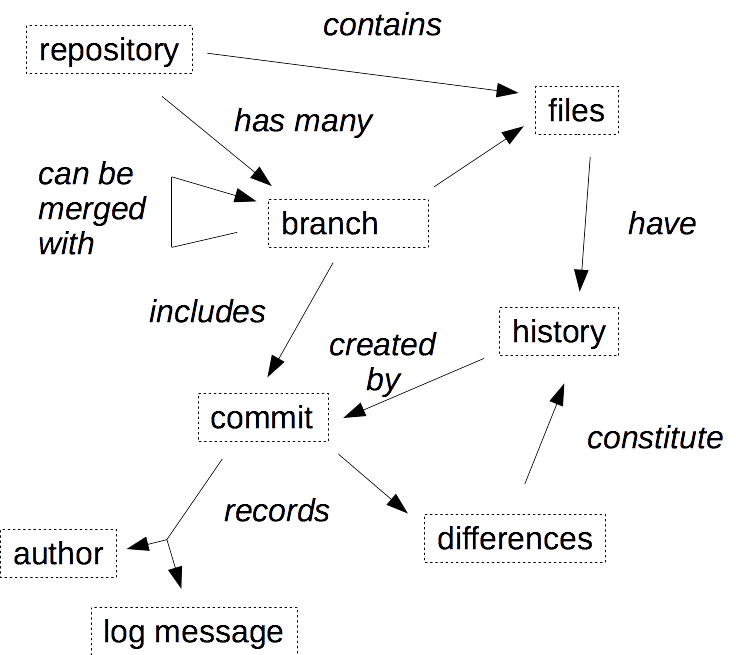

# Introduction to Git for Data Science

This course is an introduction to version control with Git
for data scientists
who know just enough about the Unix shell
to run simple commands and edit text files.

## Step 0: Learner Profiles

Please see the [DataCamp Learner Profiles][profile-site] for details.

- [Anya][profile-anya] has been using Subversion on the Unix command line for years,
  but has never used Git.
  This course will show her the similarities and differences between the two.

- [Catalina][profile-catalina] will take this course herself if she has time,
  as it would help her with her own research,
  but it is too advanced for her students.

- [Jasmine][profile-jasmine] has never used version control,
  and has only just completed DataCamp's "Introduction to the Unix Shell".
  Most of the ideas in this course will be new to her.
  She will be disappointed to discover that Git doesn't handle Microsoft file formats cleanly.

- [Thanh][profile-thanh] has used Git from inside RStudio,
  but has never branched or merged.
  This course will show him what's going on under the hood when he does a commit,
  and how to collaborate with colleagues through GitHub.

- [Yngve][profile-yngve] already knows the material in this course.

## Step 1: Concept Map



## Step 2: Summative Assessment

1. Clone the Git repository whose URL you have been given.
2. View the changes made in the most recent commit.
3. Create a new branch called `rewriting-conclusion` and switch to it.
4. In that branch, remove every occurrence of the word "not" from the last paragraph of the file `report.txt`.
5. Commit your changes with the log message "Correcting conclusions".
6. While still in that branch, pull in the content of the `rewriting-intro` branch from the repository you cloned.
7. Merge the changes in that branch with the changes you just made,
   keeping your changes to the last paragraph
   and all of their changes to the other paragraphs.
8. Push the merged to a newly-created branch called `rewriting-conclusion` in the repository you cloned.

## Step 3: Formative Assessments

### Looking at history

Go into the directory `regional` and look at its history.

1. What is the log message of the very first commit?
2. Who made that commit?

### Credit and blame

1. Go into the directory `regional`.
2. Who was the last person to change the first line of the file `central.csv`?

### Viewing differences

1. Go into the directory `regional`.
2. How many lines were changed in the file `northern.csv` in the most recent commit?
3. What files were added in the second-most-recent commit?

### Turning a project into a repository

1. Go into the directory `report`.
2. Use `git init` to initialize Git in that directory.
3. Add all of the files in that directory and its sub-directories to the newly-created repository
   with "Starting to use Git" as the log message.

### Creating a new repository

1. Create a new Git repository called `thesis` inside your home directory.
2. Add these three files (replacing "[your name]" with your name in each case):
   - `README.md` containing the sentence "PhD thesis of [your name]."
   - `LICENSE.md` containing the sentence "Copyright (c) [your name]".
3. Add and commit those two files (and *only* those two files) with the log message "Initializing."

### Saving changes

1. Go into the directory `regional`.
2. Add a line containing the data shown below to the file `eastern.csv`.
3. Commit your change with the log message "Adding September's data."

```
2017,9,30,27,11
```

### Undoing changes

1. Go into the directory `regional`.
2. Undo the most recent *two* commits.

### Listing branches

1. What branches are there in the directory `regional`?
2. Which of these branches are you currently on?

### Comparing branches

1. Go into the directory `regional`.
2. Compare the contents of the `master` branch with the `analysis` branch.
3. Which files contain differences?


### Creating branches

1. Go into the directory `regional`.
2. Create a new branch called `reporting`.
3. Delete the file `reporting.sh` in that branch and commit your changes
   *without* affecting any other branch.

### Merging without conflicts

1. Go into the directory `regional`.
2. Merge the branch `update` into the branch `master`
   using "Consolidating work" as the log message.

### Merging with conflicts

1. Go into the directory `regional`.
2. Merge the branch `update` into the branch `master`.
3. Resolve the conflicts to keep all of the lines containing the word "KEEP".
4. Commit the reconciled version with the log message "Integrating changes".

### Cloning repositories

Clone the repository `file:///home/thanh/work`
to create a repository called `work` in your home directory.

### Exploring remotes

1. Go into the repository `regional`.
2. Which of the following is *not* a remote repository for `regional`?

### Pulling in changes

1. Go into the repository `regional`.
2. Pull changes from the `master` branch of the remote `upstream` into the `master` branch of your repository.

### Pushing changes

1. Go into the repository `regional`.
2. Delete the file `temporary.csv`.
3. Commit your change with the log message "Getting rid of temporary file".
4. Push your change to the remote repository `upstream`.

### Resolving remote conflicts

1. Go into the repository `regional`.
2. Pull changes from the `master` branch of the remote `upstream` into the `master branch of your repository.
3. Resolve the conflicts in `report.txt` to keep all of the lines containing the word "KEEP".
4. Commit your resolution with the log message "Integrating changes".

## Step 4: Course Outline

1. Basic operations
   1. Viewing the log with `git log`
   2. Line-by-line history with `git blame`
   3. Saving changes to existing files with `git add` and `git commit`
   4. Log messages
   5. Viewing differences with `git diff`
   6. Naming commits with hashes
   7. Naming commits with `HEAD~N`
2. Setting up a new project
   1. Viewing and configuring preferences with `git config`
   2. Initializing a repository with `git init`
   3. Ignoring files with `.gitignore`
   4. Common files: `README.md`, `LICENSE.md`, and `CITATION.md`
3. Working with branches
   1. Listing branches with `git branch`
   2. Switching between branches with `git checkout`
   3. Viewing differences between branches
   4. Merging changes with `git merge`
   5. Recognizing conflicts
   6. Resolving conflicts
   7. Avoiding conflicts
4. Collaborating
   1. Listing remotes with `git remote`
   2. Adding and removing remotes
   3. Pulling from branches in remote repositories with `git pull`
   4. Pushing to branches in remote repositories with `git push`
   5. Branch-per-feature development
5. Advanced features
   1. Amending log messages with `git commit --amend`
   2. Undoing changes with `git reset`
   3. Undoing changes with `git revert`
   4. Taggig with `git tag`
   5. Strategies for handling very large files
   6. Srategies for handling binary files

The "datasets" are:

- A repository called `regional` with some history and branches.
- A directory called `report` containing some files and sub-directories for the learner to initialize as a Git repository.
- A repository in `/home/thanh/work` for the learner to clone, pull from, and push to.

## Step 5: Course Overview

**Course Description**

Version control is one of the power tools of programming.
It allows you to keep track of what you did when,
undo any changes you have decided you don't want,
and collaborate at scale with other people.
This lesson will introduce you to Git,
a modern version control tool that is very popular with data scientists and software developers alike,
and show you how it can help you get more done in less time and with less pain.

**Learning Objectives**

- Explain the pros and cons of version control compared to alternatives like Dropbox and Google Docs.
- Create new repositories and turn existing projects into repositories.
- Configure basic settings in Git.
- View and explain a repository's history.
- Save changes to files.
- Resolve conflicts that arise when changing files.
- Create and navigate branches.
- Undo changes to files.
- Explain the relationships between commits, branches, and remote repositories.
- Pull changes from, and push changes to, remote repositories.

**Prerequisites**

- [Introduction to the Unix Shell for Data Scientists][course-shell-intro]

[course-shell-intro]: https://www.datacamp.com/courses/intro-to-unix-shell
[profile-anya]: https://github.com/datacamp/learner-profiles#anya
[profile-catalina]: https://github.com/datacamp/learner-profiles#catalina
[profile-jasmine]: https://github.com/datacamp/learner-profiles#jasmine
[profile-site]: https://github.com/datacamp/learner-profiles
[profile-thanh]: https://github.com/datacamp/learner-profiles#thanh
[profile-yngve]: https://github.com/datacamp/learner-profiles#yngve
